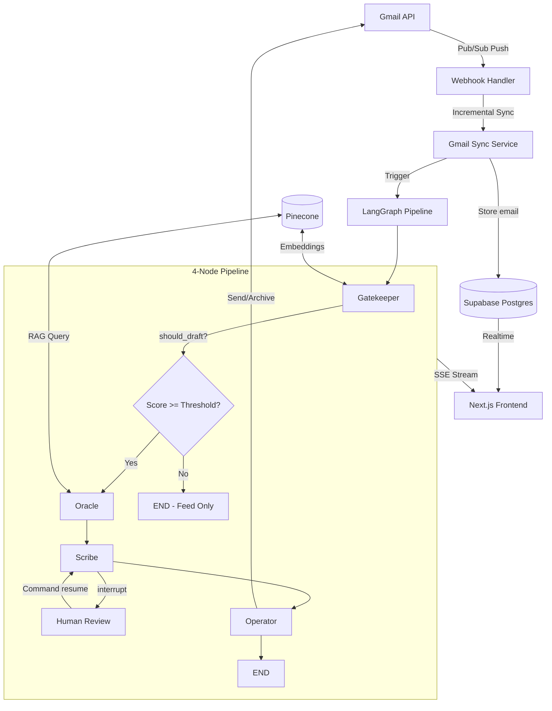

# Architecture

CHIEF is a 4-node LangGraph pipeline that processes incoming emails through PII sanitization, importance scoring, context retrieval, and draft generation — then pauses for human approval before sending.

## System Overview



## Data Flow

### 1. Email Ingestion

```
Google Pub/Sub → POST /api/webhooks/gmail → Verify OIDC token
    → Decode {emailAddress, historyId}
    → Look up user by email
    → Incremental sync via Gmail API (fetch new messages since last historyId)
    → Store each email in Supabase `emails` table
    → Invoke LangGraph pipeline per email
```

### 2. Pipeline Execution

```
graph.ainvoke({email_id, user_id, raw_email}) with thread_id config

  Gatekeeper:
    → Sanitize PII from body (Presidio / regex)
    → Query Pinecone for sender history
    → Score importance 1-10 via Gemini Flash
    → Update `emails` table with score + sanitized body
    → Upsert email embedding to Pinecone
    → Decide: should_draft = score >= user's threshold

  Oracle (if should_draft):
    → Query Pinecone for top-5 relevant past emails
    → Synthesize context briefing via Gemini Flash
    → Determine suggested tone (professional/casual/formal/brief)

  Scribe:
    → Load user's voice profile from Supabase
    → Get few-shot examples from past sent drafts
    → Generate draft via Claude Sonnet 4
    → If confidence >= 0.9 and auto_draft: auto-approve
    → Otherwise: interrupt() — graph pauses

  [Human swipes right/left in frontend]
  POST /api/drafts/{thread_id}/approve → Command(resume={approved, user_edits})

  Operator (after resume):
    → If approved: send via Gmail API, store draft as "sent"
    → If rejected: archive via Gmail labels, store draft as "rejected"
    → Update `emails.has_draft = false`
```

### 3. Frontend Updates

The frontend uses three real-time channels:

| Channel | Mechanism | Purpose |
|---------|-----------|---------|
| Email feed | Supabase Realtime (Postgres Changes) | New emails + score updates |
| Draft feed | Supabase Realtime (Postgres Changes) | New drafts + status changes |
| Pipeline progress | SSE via `/api/email/{id}/stream` | Node-by-node status events |

## Multi-Tenancy Model

| Layer | Isolation Strategy |
|-------|-------------------|
| Database | Supabase RLS — every table has `user_id = auth.uid()` policies |
| Vector DB | Pinecone namespaces — `user_{uuid}` per user |
| Tokens | Supabase Vault — encrypted at rest, per-user secret names |
| Graph State | PostgresSaver — checkpoints keyed by `thread_id` |
| API | JWT middleware — `Authorization: Bearer <supabase-jwt>` on every endpoint |

## LLM Tier Strategy

| Tier | Model | Use Cases | Why |
|------|-------|-----------|-----|
| Operational | Gemini Flash | Importance scoring, context synthesis | Fast, cheap, good enough for classification |
| Deliverable | Claude Sonnet 4 | Draft generation | High quality writing, voice matching |

## Security Model

1. **PII Sanitization** — All email bodies pass through `services/pii_sanitizer.py` before any LLM call or database storage
2. **No Auto-Send** — Every email requires explicit human approval (swipe right). Even high-confidence auto-approved drafts still go through the send pipeline
3. **JWT Authentication** — All API endpoints validate Supabase JWTs. No endpoint trusts `user_id` from query params
4. **Pub/Sub Verification** — Webhook validates Google OIDC tokens
5. **Vault Encryption** — Gmail OAuth tokens stored encrypted in Supabase Vault
6. **RLS** — Row-Level Security on all tables. Backend uses `service_role` key (bypasses RLS), but API layer enforces authorization via JWT
7. **Input Validation** — Pydantic models with length limits. Pagination capped at 100 per page

## File Structure

```
backend/
├── main.py                    # ASGI dispatcher (lazy sub-app loading)
├── api/
│   ├── auth.py                # Google OAuth flow
│   ├── email.py               # Email feed + SSE streaming
│   ├── drafts.py              # Draft CRUD + approve/reject (Command resume)
│   ├── gmail.py               # Gmail watch management
│   ├── webhooks.py            # Pub/Sub webhook handler
│   ├── users.py               # User profile + settings
│   └── models.py              # Pydantic request/response models
├── agents/
│   ├── state.py               # EmailState TypedDict
│   ├── graph.py               # LangGraph compilation + checkpointer
│   ├── gatekeeper.py          # Node 1: PII + scoring
│   ├── oracle.py              # Node 2: RAG context
│   ├── scribe.py              # Node 3: Draft + interrupt
│   ├── operator.py            # Node 4: Send/archive
│   └── prompts.py             # All LLM prompt templates
├── core/
│   ├── auth.py                # JWT validation middleware
│   ├── cors.py                # Centralized CORS config
│   ├── config.py              # Environment variables
│   ├── llm.py                 # LLM factory (operational/deliverable)
│   ├── supabase_client.py     # Supabase client singleton
│   └── gmail_client.py        # Gmail API helpers
├── services/
│   ├── pii_sanitizer.py       # PII detection + redaction
│   ├── rag_service.py         # Pinecone query/upsert
│   ├── gmail_sync.py          # Full + incremental sync
│   └── gmail_watch.py         # Pub/Sub watch management
└── migrations/
    ├── 001_users.sql
    ├── 002_emails.sql
    ├── 003_drafts.sql
    ├── 004_gmail_tokens.sql
    └── 005_rls_policies.sql

frontend/
├── app/
│   ├── (app)/inbox/page.tsx   # Main inbox with swipe UX
│   └── api/email/[id]/stream/ # SSE proxy route
├── hooks/
│   ├── use-realtime-emails.ts # Supabase Realtime for emails
│   ├── use-realtime-drafts.ts # Supabase Realtime for drafts
│   └── use-agent-stream.ts    # SSE hook for pipeline progress
├── components/                # UI components
└── lib/                       # Utilities + Supabase client
```
